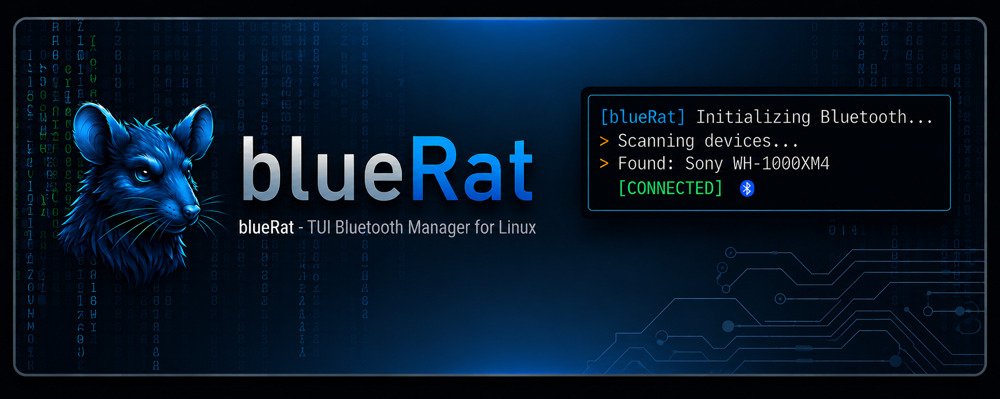

# blueRat



**blueRat** is a TUI Bluetooth manager for Linux built with [ratatui](https://ratatui.rs/).
It wraps `bluetoothctl` and `pactl`, so there are no D-Bus bindings and no daemon —
just the tools you already have, with a fast keyboard-driven interface on top.

## Features

- Paired-device list with live connected / trusted state, battery level,
  connected devices first — auto-refreshed every few seconds
- Enter toggles connect / disconnect
- Live scan & pair: discovered devices stream into the picker in real time,
  including devices that need passkey confirmation or PIN entry
- Trust / untrust and remove (with confirmation)
- Automatic audio routing: a freshly connected audio device becomes the
  default sink and existing streams move to it (PipeWire and PulseAudio) —
  and when no sink appears, blueRat says why instead of failing silently
- One row per device in the scan picker: earbuds that advertise several
  addresses at once are collapsed, and blueRat pairs the address that
  actually carries audio
- Audio profile toggle: switch a headset between high-quality playback
  (A2DP or LE Audio) and HFP/HSP (microphone enabled)
- Built-in doctor (`d`, or `--doctor`) for the classic "connected but sound
  still comes out of the speakers" case
- Fuzzy filter, device details popup, banner-style event log
- All blocking operations run on a worker thread — the UI never freezes

## Keys

| Key                    | Action                                                        |
|------------------------|---------------------------------------------------------------|
| `j` / `k` / arrows     | navigate                                                      |
| `Enter`                | connect / disconnect (in scan picker: pair + trust + connect) |
| `s`                    | scan & pair new device (live picker)                          |
| `a`                    | toggle audio profile (A2DP ↔ headset/mic)                     |
| `i`                    | device details popup (`j`/`k` scroll)                         |
| `/`                    | fuzzy filter the device list                                  |
| `t`                    | toggle trust                                                  |
| `x` / `Del`            | remove device (confirmation)                                  |
| `d`                    | audio diagnostics for the host + selected device               |
| `r`                    | refresh                                                       |
| `q` / `Esc` / `Ctrl-C` | quit / back (Esc clears the filter first)                     |

## Requirements

- `bluetoothctl` (bluez) — required
- `pactl` (pulseaudio-utils / pipewire-pulse) — optional, for audio routing
- a Bluetooth audio backend — this is the one people miss, because without
  it devices pair and connect normally and simply never produce a sink:
  - **Debian/Ubuntu** — `libspa-0.2-bluetooth`
  - **Fedora** — `pipewire-audio`
  - **Arch** — included in `pipewire`
  - **PulseAudio (not PipeWire)** — `pulseaudio-module-bluetooth`

Run `bluerat --doctor` to check all of the above at once.

## Troubleshooting: it connects, but audio still goes to the speakers

Press `d` in blueRat (or run `bluerat --doctor [MAC]`). The usual causes:

**The audio backend is missing.** The device connects, but no `bluez_card`
is ever created. Install the package for your distribution from the list
above and restart the session manager
(`systemctl --user restart wireplumber pipewire`).

**You paired the wrong address.** Modern earbuds advertise on several
addresses at once — a classic (BR/EDR) one that carries A2DP audio, plus
rotating LE addresses that carry only control services. They all show the
same name, so pairing the one you happen to see first is a coin flip; the LE
one connects happily and plays nothing.

blueRat collapses these into a single picker row and prefers the classic
address, so scanning and pairing from inside blueRat avoids the problem. Only
the rotating addresses fold in — two identical headsets in the same room keep
a row each and stay separately pairable. If you already paired the wrong one,
remove it with `x`, put the device back in pairing mode, and pair again from
the scan picker.

**The device is LE Audio only.** Some devices offer no classic A2DP at all.
LE Audio needs `Experimental = true` and `KernelExperimental = true` under
`[General]` in `/etc/bluetooth/main.conf` *and* a kernel that permits ISO
sockets — note that several shipping kernels accept the config flag and
still refuse the socket, in which case there is no way to route audio from
that device until the kernel gains support. `--doctor` probes the socket
directly rather than trusting the config, and tells you which case you're in.

## Build & install

```sh
make release          # build target/release/bluerat
make install          # install binary, icon and .desktop to ~/.local
make PREFIX=/usr/local install   # system-wide instead
make test             # unit tests
```

## CLI flags

```sh
bluerat                 # the TUI
bluerat --doctor        # host audio diagnostics
bluerat --doctor MAC    # host + one device, for bug reports
bluerat --help
```
